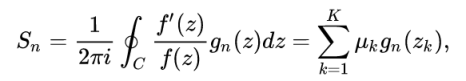

POLZE - A package to locate poles and zeros of a meromorphic function with their multiplicities
================================================================================================

[](https://github.com/nennigb/polze/actions/workflows/ci-ubuntu.yml) [](https://github.com/nennigb/polze/actions/workflows/ci-windows.yml)

This python package aims at finding poles and zeros of a meromorphic function with their multiplicities inside a closed contour in the complex plane. All the roots can be found without initial guess.

For convenience we denote by _root_ a pole or a zero. The method is based on the generalized argument principle :


 
where $C$ is a close path in the complex plane, $\mu$ is the multiplicity and $g_n$ is a probe function.
The summation is done on the $K$ zeros and poles of $f(z)$ inside the contour.
It is noteworthy that with this definition poles have negative multiplicity.

The method applies to **meromorphic** (and also to **holomorphic**) functions, **assuming there is no root on the path $C$**. The derivative may be 
given or computed thanks to high-order finite difference stencil.

Theoretical development can be found in Refs. [1, 2]  and the references therein.
The approach used here is closer to [2] where the probe functions are $g_n(z) = (z/R)^n$ and 
use a contour splitting, whereas [1] proposes to use orthogonal polynomial with respect to $f'/f$.

The main advantage of the contour splitting is its robustness and its simplicity, but the price to pay is the increase of the number 
of function evaluations, since the integral need to be evaluated for each contour. The overhead appears only for significant number
of roots (say more than 10). This bound depends on the roots distribution [2]. The ideal case is when the roots are uniformly
distributed around the integration contour.

For this kind of solver, it is generally better to increase the number of contour splits than the number of integration points.


Computation steps
-----------------
1. Compute the _moments_
2. Solve the _generalized eigenvalue problem_ involving Hankel matrix [1, 2] to get the roots
3. Solve the _Vandermonde system_ to recover the multiplicity
4. Remove the _spurious_ roots. If the rank is not well determined, we get the genuine roots and some spurious ones [2]. Spurious ones have a ~0 multiplicity.
 

References
----------

  [1] Kravanja, Peter, Marc Van Barel, and Ann Haegemans. "On computing zeros and poles of meromorphic functions." Series in Approximations and Decompositions 11 (1999): 359-370.

  [2] Chen, Hao-Tian. "On locating the zeros and poles of a meromorphic function." (2018).


Dependencies
------------
`polze` is based on `numpy`, `scipy` and `matplotlib`.


Install
-------
`polze` is designed as a standard python package. The installation can be done after cloning or downloading the repos, using 
```
pip3 install path/to/polze [--user]
```
or in _editable_ mode if you want to modify the sources
```
pip3 install -e path/to/polze
```
Note that on some systems (like ubuntu), `python3` or `pip3` should be use to call python v3.x


Runnig tests
------------
Tests are handled with `doctest` and `unittest`. To call the test procedure, simply execute the `test` module
```
python -m polze.test
```


View documentation
------------------
The doctrings are compatible with several Auto-generate API documentation, like `pdoc3`. Once the package has been installed or the at `polze` location run,
```
pdoc3 --html --force --config latex_math=True polze
```
The html files are generated in place. Then open the `polze/index.html` file. This interactive doc is particularly useful to see latex includes.


Get a started
-------------
```python
# Definition of the function
f = lambda z: np.tan(z)
df = lambda z: np.tan(z)**2 + 1 # [df is optional]
# Initialization of the solver
pz = PZ((f, df), Rmax=5, Npz=10, Ni=1024)
# Solve with moment method
pz.solve()
# Get the poles p and the zeros z
p, z = pz.dispatch()
# plot the roots
pz.plot()
# Performed an iterative refinement with Newton-Raphson method
pr, info = pz.iterative_ref()
```

Limitations
-----------
For now, `polze` use only circular integration contours in _z_ and a single kind of probe function. The contour splitting is done _a priori_ using the estimate of the number of roots (`Npz`), ie no error estimators are used.


Related projects
----------------
[`cxroots`](https://github.com/rparini/cxroots) is a Python package for finding all the roots of a function, f(z), of a single complex variable within a given contour, C, in the complex plane.
  This approach has he same theoretical basis than `polze` but is (now) limited to _analytic_ functions.


How to contribute ?
-------------------
If you want to contribute to `polze`, your are welcomed! Don't hesitate to

  - report bugs, installation problems or ask questions on [issues](https://github.com/nennigb/polze/issues);
  - propose some enhancements in the code or in the documentation through **pull requests** (PR);
  - suggest or report some possible new usages and why not start a scientific collaboration ;-)
  - ...
  
To ensure code homogeneity among contributors, we use a source-code analyzer (eg. pylint). 
Before submitting a PR, run the tests suite. New tests should be added if new functionnalies are added.

License
-------
`polze` is free software: you can redistribute it and/or modify it under the terms of the GNU General Public License as published by the Free Software Foundation, either version 3 of the License, or (at your option) any later version.
`polze` is distributed in the hope that it will be useful, but WITHOUT ANY WARRANTY; without even the implied warranty of MERCHANTABILITY or FITNESS FOR A PARTICULAR PURPOSE.  See the GNU General Public License for more details.

You should have received a copy of the GNU General Public License along with `polze`.  If not, see <https://www.gnu.org/licenses/>.
